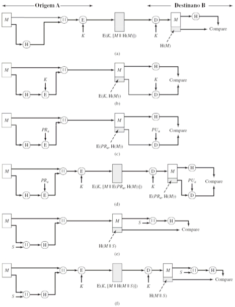

## Trabalho 4

Implementar as formas de autenticação apresentadas na imagem em anexo. Podem reaproveitar o código das atividades anteriores e fazer as devidas adaptações/atualizações.

Requisito:
Instalar a biblioteca cryptography 41.0.3 ou acima

Seguindo a imagem abaixo temos as 6 tipos de autenticações básicos:


legendas:
- M: mensagem
- K: chave
- ||: juntar em um arquivo
- E: criptografia
- D: decriptografia
- PR: chave privada
- PU: chave pública
PS: o que usam as chaves privada/pública usam o algoritimo de curva elíptica
e da chave única utiliza o algorítimo de fernet
Para testar o trabalho troque o none por quaisquer uma das autenticações:

```bash
python3 none.py
```


